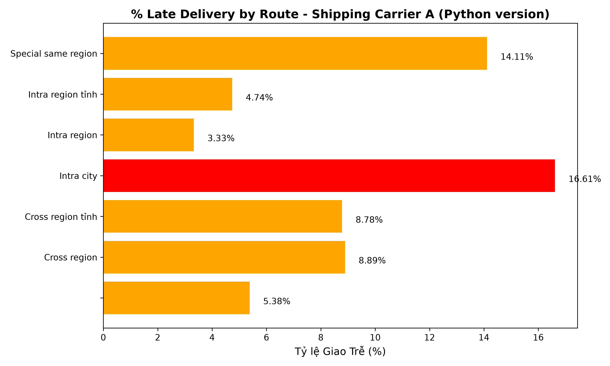

# 📦 3PL Performance Analysis Data Pipeline (E13)

<div align="center">
  
  
  
  
</div>

## 📖 Introduction
This project is Exercise 1.3 (E13) from the **Foundation of Supply Chain Analytics** course, mentored by [Trần Viết Thanh](https://www.linkedin.com/in/thanhtranviet248/).
The goal of the project is to build a multi-layer Data Pipeline to analyze the operational performance of delivery partners (3PL - Third-Party Logistics).

The dataset contains about 96,000 orders with detailed information such as order code, 3PL partner (5 carriers: A-E), seller/buyer area, transit time, weight, etc. Through this project, I demonstrate my data analysis skill development from manual methods (Excel) to automation (Python) and soon to cloud storage (BigQuery) and visualization (BI Tools).

## 📑 Table of Contents
- [Project Structure](#-project-structure)
- [Layer 1: Excel (Manual Analysis)](#-layer-1-excel-manual-analysis)
- [Layer 2: Python / Pandas (Automation)](#-layer-2-python--pandas-automation)
- [Layer 3 & 4: BigQuery & Dashboard (Coming Soon)](#-layer-3--4-bigquery--dashboard-coming-soon)
- [Results & Insights](#-results--insights)
- [Lessons Learned](#-lessons-learned)
- [Technologies Used](#-technologies-used)

## 🗂️ Project Structure
```text
📦 E13-3PL-Performance-Analysis
 ┣ 📂 docs/
 ┃   ┣ 📄 tang1_excel_analysis.md    # Detailed documentation for Layer 1 (Excel)
 ┃   ┗ 📄 tang2_python_automation.md # Detailed documentation for Layer 2 (Python)
 ┣ 📜 e13_pipeline_demo.py            # Python pipeline script (demo version)
 ┣ 📊 e13_question_1.csv            # Area & Route & Fee lookup table
 ┣ 📊 e13_question_2.csv            # SLA lookup table
 ┣ 📊 e13_question_3.csv            # Q3 questions table
 ┣ 📊 e13_question_4.csv            # Q4 questions table
 ┣ 🖼️ Bieu_do_Q4_Python.png         # Visualization chart using Matplotlib
 ┣ 📜 .gitignore
 ┗ 📜 README.md
```

> **Note:** Large data files (`.xlsx`, `ket_qua_bai_tap_e13.csv`) are not uploaded to GitHub due to size limits. See `.gitignore` for details.

📖 **Detailed Documentation:**
- [Layer 1: Data Analysis with Excel](docs/tang1_excel_analysis.md)
- [Layer 2: Automation with Python / Pandas](docs/tang2_python_automation.md)

## 📊 Layer 1: Excel (Manual Analysis)
In the initial phase, I approached the data and solved the problem using manual methods in Excel to fully understand the business logic.

- **Techniques used:** `INDEX-MATCH`, `IFS`, `AVERAGEIFS`, `VLOOKUP`, `Pivot Tables`.
- **Completed tasks:**
  - **Q1:** Mapping seller and buyer areas, categorizing as Urban/Rural based on the lookup table.
  - **Q2:** Calculating Shipping Fee based on weight ranges and routes; determining the Service Level Agreement (SLA) for delivery/return.
  - **Q3:** Calculating Actual Leadtime (`delivery_done` - `pickup_done`) and comparing it with SLA to evaluate the status as Ontime or Late.
  - **Q4:** Creating Pivot Table reports summarizing Average Leadtime, Average Fee, and Percentage of Late Delivery (% Late Delivery) by Route and 3PL partner.

## 🐍 Layer 2: Python / Pandas (Automation)
After fully grasping the logic in Layer 1, I proceeded to automate the entire data processing workflow using Python, optimizing time and avoiding manual errors.

- **Script file:** `e13_pipeline_demo.py` (demo version — full source available upon request)
- **Techniques and libraries:**
  - `pd.merge()`: Replaced `VLOOKUP` and `INDEX-MATCH`.
  - `np.where()`: Replaced conditional functions like `IF`/`IFS`.
  - `df.groupby()`: Replaced `Pivot Tables` for data aggregation.
  - Date handling: Used `pd.to_datetime()` with the parameter `origin='1899-12-30'` to decode Excel's serial date format.
  - `matplotlib`: Data visualization (exported to `Bieu_do_Q4_Python.png`).

## 🚀 Layer 3 & 4: BigQuery & Dashboard (Coming Soon)
- **Layer 3: Google BigQuery / SQL (Cloud Data Warehouse):** Moving data to a Cloud environment, using SQL to optimize queries for large datasets.
- **Layer 4: Dashboard / BI Tools (Visualization):** Building automated reports (Power BI / Looker Studio) to provide an intuitive and continuous view for management.

## 📈 Results & Insights
The output data `ket_qua_bai_tap_e13.csv` has been cleaned and fully enriched with information fields (Shipping Fee, SLA, Leadtime, Ontime/Late status).

The chart below provides a clear view of late delivery rates by route for Shipping Carrier A, helping the business make decisions on optimizing order allocation to the carriers with the lowest late delivery rate and most effective cost.

<div align="center">
  
</div>

## 💡 Lessons Learned
The transition from Excel to Python helped me discover and handle several Data Quality issues that Excel often overlooks:

1. **Excel Date Format Issues:** Dates in Excel are actually serial numbers. When reading data with Python, I had to handle this carefully by using `origin='1899-12-30'` for accurate conversion.
2. **Trailing Spaces:** City/province names containing invisible trailing spaces silently caused Excel's lookup functions to fail (returning N/A), but Python helped detect and clean them (`.str.strip()`) easily.
3. **Missing Values:** For orders without weight information, Excel automatically interprets them as `0` - leading to incorrect shipping fees. Python handles them more accurately by keeping them as `NaN`, allowing me to apply reasonable imputation strategies or drop them if necessary.

## 🛠️ Technologies Used
- **Data Analysis:** Microsoft Excel, Python (Pandas, NumPy)
- **Visualization:** Matplotlib
- **IDE / Tools:** VS Code, Jupyter Notebook

---
*This project is a testament to my mindset shift from a "Data Analyst using out-of-the-box tools" to a "Data Engineer automating analytics systems".*
